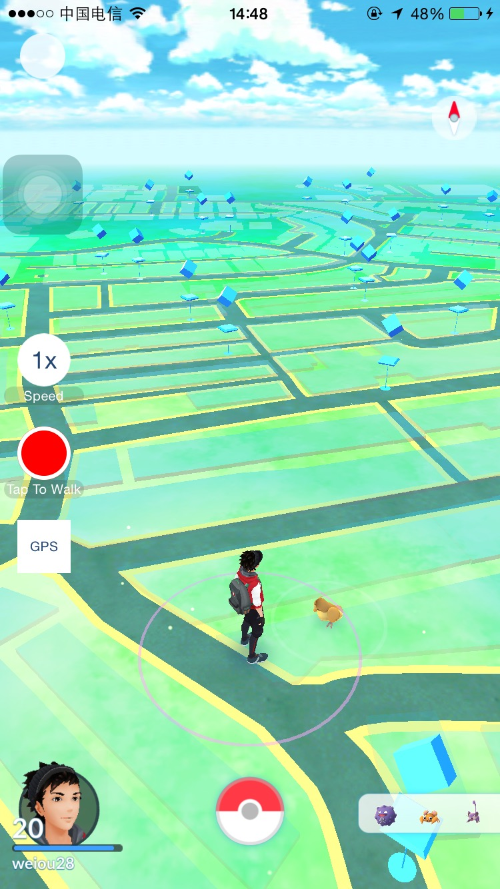
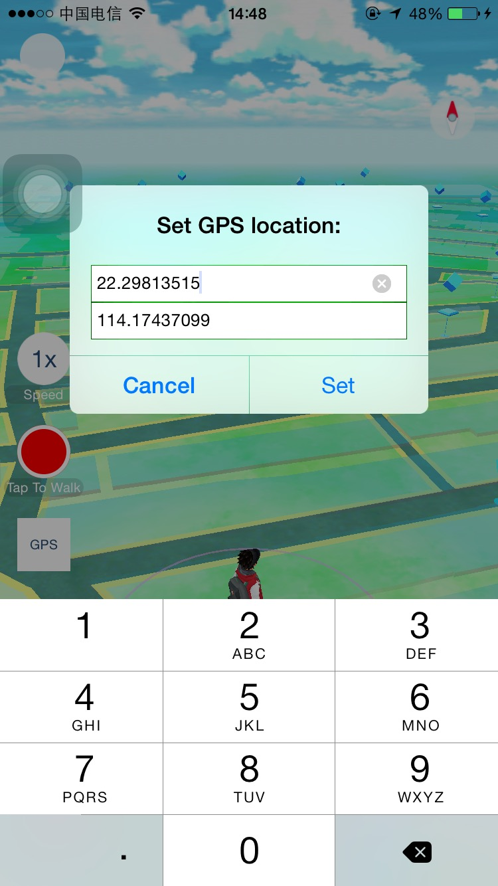

# Pokemon Go Transport


  

## Prerequisite
- Jailbroken iOS device
- Cydia
- To run Pokemon Go on a jailbroen device, you also need to install tweaks to bypass jailbroken detection.

## Install
If you already install "theos" development tools, you can modify your device id in the "Makefile" file.
```
export THEOS_DEVICE_IP = 192.168.2.12
```
Then you can compile and install deb through the following command.
```shell
make install package
```

## Features
1. Tap screen to walk.
2. Speed can be switched between 1x, 2x and 4x.
3. Set any latitude and longitude as inital location.
4. Block no GPS signal warning.

# Have Fun!
